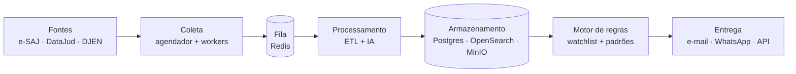
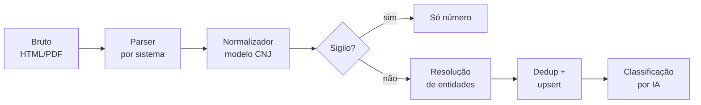

# Especificação Técnica — Sistema de Monitoramento de Distribuição Processual

Sep 23, 2026 · @Roma

## 1. Visão geral e escopo

O sistema detecta a distribuição de novos processos contra CPFs e CNPJs monitorados antes da citação e entrega alerta em até 24 horas. Também monitora padrões (classe, assunto, termos, comarca) para identificar ações de interesse. O MVP cobre só o TJSP (e-SAJ) e expande para TRT-15 e TRF-3 na fase 2. Os demais tribunais ficam com API paga como fallback.

**Objetivos do MVP**

- Cadastrar alvos (CPF, CNPJ, nome e variações) e detectar processo novo no TJSP em até 24 h da distribuição.
- Monitorar regras por classe/assunto TPU, termos livres e comarca.
- Enviar alertas por e-mail e WhatsApp, com resumo por IA quando a inicial estiver acessível.
- Formar desde o primeiro dia um datalake próprio de processos coletados.

**Fora do escopo do MVP**

- Cobertura nacional por robôs próprios.
- Acompanhamento de movimentações de processos antigos (fase 3).
- Download automatizado de peças que exijam certificado digital.
- Qualquer contorno de CAPTCHA ou de mecanismos de proteção dos tribunais.

**Requisitos não funcionais**

| Requisito | Meta do MVP |
| --- | --- |
| Latência de detecção (alvo crítico) | ≤ 6 h da disponibilização na consulta pública |
| Latência de detecção (alvo padrão) | ≤ 24 h |
| Taxa de requisições por tribunal | Configurável; padrão 1 req a cada 3–5 s por worker, sem paralelismo agressivo |
| Disponibilidade da API/painel | 99% mensal |
| Rastreabilidade | Todo dado coletado guarda fonte, URL, data/hora e HTML/PDF bruto |
| Falso positivo por homônimo | Alerta só é "confirmado" com CPF/CNPJ; demais saem como "a verificar" |

## 2. Arquitetura em camadas

O sistema tem seis camadas desacopladas por fila, para que um robô quebrado não derrube o restante. Cada tribunal é um adaptador isolado atrás de uma interface comum.



O fluxo lê da esquerda para a direita; a fila entre coleta e processamento permite reprocessar dados brutos sem voltar ao tribunal.

| Camada | Responsabilidade | Tecnologia |
| --- | --- | --- |
| Fontes | Consulta pública e-SAJ (partes e distribuição), DataJud (classe/assunto, sem partes), DJEN/Comunica (publicações), Receita (CNPJ), API paga (fallback) | Externas |
| Coleta | Agendar consultas, executar adaptadores, respeitar limites por tribunal, salvar bruto | Temporal (ou APScheduler no MVP), Playwright, httpx |
| Fila | Desacoplar coleta e processamento, permitir retry | Redis Streams (MVP) ou RabbitMQ |
| Processamento | Parsing, normalização CNJ, resolução de entidades, dedup, filtro de sigilo, classificação por IA | Python, selectolax, pdfplumber, Claude API |
| Armazenamento | Modelo relacional, busca full-text, arquivos brutos | PostgreSQL 16, OpenSearch 2.x, MinIO |
| Regras | Casar processos novos com alvos e padrões, calcular urgência | Python (serviço próprio) |
| Entrega | Alertas, painel, API, webhooks | FastAPI, Next.js, SMTP, API WhatsApp Business |

## 3. Modelo de dados (PostgreSQL)

O modelo gira em torno de três entidades: processo, pessoa e alvo monitorado. O número CNJ é a chave natural do processo; a pessoa é deduplicada por documento.

| Tabela | Campos principais | Observações |
| --- | --- | --- |
| `tribunal` | id, sigla (TJSP), sistema (esaj, pje, eproc), grau, ativo, limite\_req\_min | Configuração por tribunal e sistema |
| `processo` | id, numero\_cnj (único), tribunal\_id, classe\_codigo, classe\_nome, assuntos (jsonb), comarca, foro, vara, data\_distribuicao, valor\_causa, segredo (bool), status\_coleta, primeira\_coleta\_em, atualizado\_em | Índice em numero\_cnj, data\_distribuicao, comarca |
| `pessoa` | id, documento (CPF/CNPJ, nullable), tipo (PF/PJ), nome, nome\_normalizado | Índice único parcial em documento; índice trigram em nome\_normalizado |
| `parte` | id, processo\_id, pessoa\_id, polo (ativo, passivo, terceiro), tipo\_participacao | Liga pessoa a processo |
| `advogado` | id, parte\_id, nome, oab\_numero, oab\_uf | Útil para inteligência e deduplicação |
| `movimento` | id, processo\_id, data, codigo\_tpu, descricao, hash | Hash evita duplicata; usado na fase 3 |
| `alvo` | id, cliente\_id, tipo (documento, nome), valor, variacoes (text\[\]), prioridade (critica, padrao), ativo, criado\_em | A watchlist |
| `regra` | id, cliente\_id, nome, classes (int\[\]), assuntos (int\[\]), termos (text\[\]), comarcas (text\[\]), polo, valor\_min, ativo | Monitoramento por padrão |
| `ocorrencia` | id, processo\_id, alvo\_id ou regra\_id, confianca (confirmada, a\_verificar), score\_urgencia, detectado\_em, status (novo, visto, descartado) | Resultado do casamento |
| `alerta` | id, ocorrencia\_id, canal, destino, enviado\_em, status\_envio, erro | Log de entrega |
| `coleta_bruta` | id, tribunal\_id, tipo\_consulta, parametro\_hash, url, http\_status, objeto\_storage, coletado\_em | Guarda o HTML/PDF no MinIO para reprocessar |
| `execucao_robo` | id, tribunal\_id, iniciado\_em, finalizado\_em, consultas, sucesso, erros, processos\_novos | Base do health-check |
| `cliente` | id, nome, cnpj, plano, contatos (jsonb) | Multi-tenant desde o início |
| `auditoria` | id, usuario\_id, acao, entidade, entidade\_id, em, detalhes (jsonb) | Exigência LGPD |

O parâmetro de consulta (CPF, CNPJ, nome) é armazenado em `coleta_bruta` apenas como hash, para não espalhar dado pessoal em logs. Todas as tabelas de negócio carregam `cliente_id` com Row Level Security no Postgres.

## 4. Contrato dos adaptadores de tribunal

Todo tribunal implementa a mesma interface e devolve os mesmos objetos; o resto do sistema nunca conhece HTML de tribunal. Adicionar um tribunal novo significa escrever um adaptador e registrá-lo, sem tocar no núcleo.

```python
from abc import ABC, abstractmethod
from dataclasses import dataclass, field
from datetime import date, datetime

@dataclass
class ParteDTO:
    nome: str
    polo: str                  # "ativo" | "passivo" | "terceiro"
    documento: str | None = None
    advogados: list[dict] = field(default_factory=list)  # {nome, oab_numero, oab_uf}

@dataclass
class ProcessoDTO:
    numero_cnj: str
    tribunal: str
    classe: str | None
    assuntos: list[str]
    comarca: str | None
    vara: str | None
    data_distribuicao: date | None
    valor_causa: float | None
    segredo: bool
    partes: list[ParteDTO]
    url_origem: str
    coletado_em: datetime
    bruto_ref: str             # chave do HTML/PDF no MinIO

class AdaptadorTribunal(ABC):
    sigla: str                 # "TJSP"
    sistema: str               # "esaj"

    @abstractmethod
    async def buscar_por_documento(self, documento: str) -> list[str]:
        """Retorna números CNJ vinculados ao CPF/CNPJ."""

    @abstractmethod
    async def buscar_por_nome(self, nome: str) -> list[str]:
        """Retorna números CNJ vinculados ao nome."""

    @abstractmethod
    async def obter_processo(self, numero_cnj: str) -> ProcessoDTO:
        """Coleta a capa completa com partes."""

    async def saude(self) -> bool:
        """Consulta sentinela com resultado conhecido."""
        return True
```

**Erros padronizados** (o orquestrador decide o que fazer com cada um):

| Exceção | Significado | Ação do orquestrador |
| --- | --- | --- |
| `TribunalIndisponivel` | Timeout, 5xx, manutenção | Retry com backoff exponencial (1, 5, 15, 60 min) |
| `LimiteAtingido` | 429 ou bloqueio temporário | Pausar o tribunal inteiro e reduzir a taxa |
| `DesafioHumano` | Página exige CAPTCHA ou verificação | Parar o adaptador, alertar operação; não contornar |
| `LayoutAlterado` | Seletores esperados não encontrados | Parar o adaptador, abrir incidente de manutenção |
| `ProcessoSigiloso` | Segredo de justiça | Registrar só o número, sem partes |

**Rate limit:** cada adaptador recebe um token bucket por tribunal, lido da tabela `tribunal`. Nenhum worker consulta fora dele, e o limite vale para a soma de todos os workers.

## 5. Adaptadores do TJSP (e-SAJ e eproc)

O MVP precisa de dois adaptadores para o TJSP, não um: o tribunal está substituindo o e-SAJ pelo eproc por ciclos de competência. O eproc começou em 31/03/2025 nos Juizados Especiais Cíveis do Butantã e do Tatuapé ([Legalcloud](https://legalcloud.com.br/eproc-tjsp-implementacao-resumo-cronograma-prazos/)). O 3º ciclo, a partir de agosto de 2026, abrange a Fazenda Pública, e nas unidades implantadas os processos novos são distribuídos somente no eproc ([TJSP](https://www.tjsp.jus.br/Noticias/Noticia?codigoNoticia=113957)). Processos antigos, recursos e cumprimentos de sentença do SAJ seguem no SAJ até a migração ([TJSP](https://www.tjsp.jus.br/Noticias/Noticia?codigoNoticia=108715)).

Consequência para o monitoramento de distribuição: todo alvo deve ser consultado nos dois sistemas, e a tabela `tribunal` precisa registrar quais comarcas e competências já estão no eproc. Esse mapeamento é refeito a cada ciclo publicado no cronograma oficial.

**Estratégias de descoberta**

| Estratégia | Como funciona | Latência | Serve para |
| --- | --- | --- | --- |
| A. Varredura por alvo | Para cada alvo ativo, consultar por CPF/CNPJ (e por nome, se não houver documento) no e-SAJ e no eproc; comparar os números CNJ retornados com os já conhecidos; número novo vai para `obter_processo` | Horas | Alerta antes da citação (núcleo do MVP) |
| B. Varredura por padrão | Consultar o DataJud por classe, assunto, órgão julgador e data de ajuizamento; cada número novo vai para `obter_processo` no tribunal para obter as partes | Dias (depende da atualização do DataJud) | Monitoramento por tipo de ação e prospecção de mercado |
| C. Publicações | Consultar a DJEN/Comunica por nome ou OAB; cruzar com a base | Dias a semanas | Confirmação e cobertura de processos que escaparam de A |

**Fluxo do adaptador e-SAJ (1º grau)**

1. Abrir a consulta pública de 1º grau e selecionar o tipo de pesquisa (documento da parte ou nome da parte).
2. Submeter o formulário com o parâmetro; paginar a lista de resultados.
3. Extrair de cada linha: número CNJ, classe, assunto, foro, vara, data de recebimento/distribuição.
4. Para cada número novo, abrir a página do processo e extrair partes, polos, advogados e valor da causa.
5. Salvar o HTML de cada página no MinIO antes de fazer o parsing.

**Fluxo do adaptador eproc**: mesma sequência, com seletores próprios. Na fase 0, confirmar quais filtros a consulta pública do eproc do TJSP oferece (número, nome, documento) e registrar no repositório.

**Cautelas obrigatórias**

- Taxa conservadora, horários de menor carga para varreduras grandes, cache de 24 h por consulta.
- User-agent identificável e contato técnico; respeitar robots.txt e os termos de uso do portal.
- Página com CAPTCHA ou verificação humana: o adaptador para e levanta `DesafioHumano`. Não há contorno automatizado; a saída é reduzir a frequência ou usar a API paga para aquele tribunal.
- Consultas por nome geram homônimos: o resultado só vira ocorrência "confirmada" se o documento bater.
- Testes contra páginas HTML salvas (fixtures), nunca contra o tribunal em CI.

## 6. Pipeline de processamento

Cada item bruto passa por seis etapas idempotentes; reprocessar o mesmo HTML sempre produz o mesmo resultado. Assim, uma melhoria no parser pode ser aplicada a toda a base histórica.



**Normalização CNJ**

- Validar o número no formato NNNNNNN-DD.AAAA.J.TR.OOOO, incluindo o dígito verificador (módulo 97, Res. CNJ 65/2008).
- Mapear classe e assunto textuais para os códigos das Tabelas Processuais Unificadas (TPU); guardar texto original e código.
- Datas em ISO 8601, valores em centavos (inteiro), comarca e foro em forma canônica.

**Resolução de entidades**

1. Documento presente: normalizar (só dígitos), validar dígitos verificadores de CPF/CNPJ e usar como chave da `pessoa`.
2. Documento ausente: normalizar o nome (maiúsculas, sem acento, sem pontuação, remover sufixos como LTDA, ME, EIRELI, S/A) e buscar candidatos por similaridade trigram ≥ 0,85.
3. Candidato único com mesmo nome normalizado e mesma comarca de atuação: vincular com confiança "a verificar".
4. Nunca fundir duas pessoas com documentos diferentes; nunca promover "a verificar" a "confirmada" sem documento.

**Deduplicação**: upsert por número CNJ; partes por (processo, pessoa, polo); movimentos por hash de data + descrição.

**Classificação por IA** (Claude API, só quando há texto disponível: capa e, se pública, a inicial):

| Saída | Uso |
| --- | --- |
| Resumo em até 5 linhas | Corpo do alerta |
| Tese/tipo de pedido (ex.: revisional, cobrança, indenizatória) | Filtros e regras |
| Pedido de tutela de urgência (sim/não) | Score de urgência |
| Valor em risco estimado | Score de urgência |
| Termos-chave extraídos | Indexação no OpenSearch |

A IA recebe só o necessário (princípio da necessidade da LGPD) e a resposta é JSON validado por schema; falha de validação não bloqueia o alerta, só o enriquecimento.

## 7. Motor de regras e alertas

O motor roda sempre que um processo é inserido ou tem partes atualizadas, e gera no máximo uma ocorrência por (processo, alvo) ou (processo, regra). Alerta repetido é o erro que mais faz o cliente desligar o sistema.

**Casamento**

- Watchlist por documento: igualdade exata do CPF/CNPJ normalizado → ocorrência "confirmada".
- Watchlist por nome: nome normalizado igual ou em `variacoes`, ou similaridade ≥ 0,9 → ocorrência "a verificar".
- Regra por padrão: todos os filtros preenchidos devem casar (classe E assunto E comarca E polo E valor mínimo); termos livres são consultados no OpenSearch sobre capa + resumo da IA.

**Score de urgência (0 a 100)**

| Fator | Pontos |
| --- | --- |
| Pedido de tutela de urgência ou liminar | +40 |
| Alvo no polo passivo | +20 |
| Valor da causa acima do limite do cliente | +15 |
| Classe de rito rápido (execução, busca e apreensão, monitória, despejo) | +15 |
| Alvo com prioridade "crítica" | +10 |

Score ≥ 60 dispara alerta imediato por todos os canais; entre 30 e 59, alerta imediato por e-mail; abaixo de 30, entra no resumo diário. Os pesos ficam em configuração por cliente.

**Canais**

| Canal | Conteúdo | Observação |
| --- | --- | --- |
| E-mail | Número CNJ, vara, partes, classe, valor, resumo, link da consulta pública | Canal padrão; resumo diário às 7h |
| WhatsApp | Versão curta: alvo, tipo de ação, valor, urgência | Via API oficial WhatsApp Business, com modelo aprovado |
| Webhook | JSON com a ocorrência completa, assinado com HMAC-SHA256 | Para integrar ao sistema do cliente |
| Painel | Lista de ocorrências com filtro e botão "descartar" | Descarte alimenta a melhoria do casamento por nome |

## 8. API REST e painel

A API é a única porta de entrada do painel e dos clientes; o painel não acessa o banco diretamente. Isso permite vender o sistema como API desde a fase 2.

| Método e rota | Função |
| --- | --- |
| `POST /v1/alvos` | Cadastrar alvo (documento ou nome, variações, prioridade) |
| `GET /v1/alvos` · `DELETE /v1/alvos/{id}` | Listar e desativar alvos |
| `POST /v1/regras` · `GET /v1/regras` | Criar e listar regras por padrão |
| `GET /v1/ocorrencias?status=&desde=&score_min=` | Listar ocorrências do cliente |
| `PATCH /v1/ocorrencias/{id}` | Marcar como vista ou descartada |
| `GET /v1/processos/{numero_cnj}` | Capa normalizada de um processo da base |
| `POST /v1/consultas` | Consulta sob demanda (assíncrona; resposta por webhook ou polling) |
| `POST /v1/webhooks` · `GET /v1/webhooks` | Configurar destinos de webhook |
| `GET /v1/saude` | Estado dos adaptadores (para o painel de operação) |

**Autenticação**: painel com login (e-mail + senha com hash Argon2 e segundo fator); integrações com chave de API por cliente, enviada em header e armazenada só como hash. Toda chamada grava em `auditoria`.

**Painel (Next.js)**: telas de alvos, regras, ocorrências (com filtros por score, tribunal, período), detalhe do processo, configurações de canais e, para o operador, saúde dos robôs.

## 9. Infraestrutura, stack e observabilidade

O MVP roda inteiro em uma VPS com Docker Compose, hospedada no Brasil; a separação em serviços permite mover cada um para nuvem gerenciada depois, sem reescrever.

| Serviço | Imagem/tecnologia | Recursos iniciais |
| --- | --- | --- |
| `api` | Python 3.12, FastAPI, SQLAlchemy 2, Pydantic 2 | 1 vCPU, 1 GB |
| `coletor` | Python, Playwright (Chromium), httpx, selectolax | 2 vCPU, 4 GB (navegador consome memória) |
| `processador` | Python, pdfplumber, cliente Claude API | 1 vCPU, 2 GB |
| `regras-alertas` | Python, SMTP, WhatsApp Business API | 0,5 vCPU, 512 MB |
| `agendador` | APScheduler no MVP; Temporal na fase 3 | 0,5 vCPU, 512 MB |
| `postgres` | PostgreSQL 16 + pg\_trgm | 2 vCPU, 4 GB, SSD |
| `opensearch` | OpenSearch 2.x, nó único | 2 vCPU, 4 GB |
| `redis` | Redis 7 (filas e cache) | 512 MB |
| `minio` | MinIO (bruto HTML/PDF) | Disco conforme volume |
| `painel` | Next.js | 0,5 vCPU, 512 MB |

Uma VPS de 8 vCPU e 16–32 GB atende o MVP. Backup diário do Postgres e do MinIO para armazenamento externo, com retenção de 30 dias e teste de restauração mensal.

**Saúde dos robôs** (o ponto que mais derruba sistemas desse tipo):

- Consulta sentinela a cada hora por adaptador: um número CNJ público conhecido cuja capa deve ser extraída com campos fixos.
- Alarme se a sentinela falhar 2 vezes seguidas, se a taxa de erro passar de 10% em 1 h, ou se processos novos do dia ficarem abaixo de 50% da média móvel de 14 dias.
- Métricas no Prometheus e painéis no Grafana: consultas/min, latência por tribunal, erros por tipo de exceção, processos novos/dia, alertas enviados.
- Logs estruturados em JSON, sem CPF/CNPJ em texto claro (usar hash).

**Custo de IA**: classificar só processos que geraram ocorrência, não toda a base, e usar um modelo mais leve para classificação e o mais capaz só para resumos longos.

## 10. Conformidade

O sistema trata dados pessoais públicos, mas públicos não significa livres: cada uso precisa de base legal, finalidade e registro. Estas regras entram no código, não só na política.

| Tema | Regra no sistema |
| --- | --- |
| LGPD — base legal | Legítimo interesse ou execução de contrato com o cliente monitorado; registrar a finalidade de cada alvo e regra no cadastro |
| LGPD — necessidade | Coletar só os campos do modelo; não guardar endereço, filiação ou dados que a capa trouxer além disso |
| LGPD — segurança | Criptografia em repouso (disco e MinIO), TLS em trânsito, RLS por cliente, logs sem documento em claro |
| LGPD — direitos do titular | Canal de atendimento e rotina de exclusão/anonimização de pessoa que não seja alvo de nenhum cliente |
| LGPD — retenção | Bruto HTML/PDF por 12 meses; dados normalizados enquanto houver alvo ou regra ativa ligada |
| Segredo de justiça | Nunca armazenar partes nem conteúdo; só o número, e só se aparecer em fonte pública |
| Justiça do Trabalho | A Res. CNJ 121/2010 restringe a consulta pública pelo nome das partes; o adaptador trabalhista (fase 2) deve seguir a consulta disponível e não tentar reconstruir listas de reclamantes |
| Termos de uso dos tribunais | Respeitar robots.txt, limites de taxa e bloqueios; CAPTCHA encerra a coleta automatizada daquele tribunal |
| Ética OAB | O escritório não usa as ocorrências para abordar réus que não são clientes (captação vedada pelo Código de Ética e pelo Provimento 205/2021); o produto pode ser vendido a empresas e escritórios, que respondem pelo próprio uso |
| Contrato com clientes | Termo de uso do produto com cláusula de finalidade lícita, proibição de revenda de dados e responsabilidade pelo uso |

**Pendência a validar antes da fase 2**: parecer próprio sobre a coleta automatizada em cada tribunal adicionado, considerando os termos de uso vigentes e eventuais atos normativos sobre robôs.

## 11. Roadmap

São quatro fases; a fase 1 entrega valor real com um único tribunal, e cada fase só começa quando a anterior cumpre seus critérios de aceite. Os prazos são estimativas para um desenvolvedor com apoio do Claude Code.

| Fase | Entregas | Critério de aceite | Estimativa |
| --- | --- | --- | --- |
| 0. Descoberta | Mapear filtros e HTML das consultas públicas do e-SAJ e do eproc do TJSP; salvar 30+ páginas como fixtures; levantar comarcas já no eproc; parecer de conformidade | Fixtures cobrindo lista, capa, sigilo, sem resultado e erro | 1 semana |
| 1. MVP TJSP | Adaptadores e-SAJ e eproc, modelo de dados, pipeline, watchlist por documento e nome, alertas por e-mail, painel mínimo | 20 alvos reais monitorados por 30 dias; ≥ 95% dos processos novos detectados em ≤ 24 h, conferidos por amostragem manual | 5–7 semanas |
| 2. Expansão | Adaptadores PJe (TRT-15, TRF-3), regras por padrão via DataJud, WhatsApp, webhooks, classificação por IA, API pública, fallback para API paga nos demais tribunais | Cobertura das três justiças na região; primeiro cliente externo pagante | 6–8 semanas |
| 3. Produto | Acompanhamento de movimentações, histórico retroativo sob demanda, Temporal, multi-tenant completo, faturamento | 10 clientes ativos; custo de coleta por alvo medido | contínua |

**Riscos principais**

- Mudança de layout ou migração de sistema no TJSP durante o desenvolvimento: mitigado por adaptadores isolados, fixtures e health-check.
- Bloqueio de acesso: mitigado por taxa conservadora e fallback para API paga.
- Manutenção contínua subestimada: reservar pelo menos 20% do tempo de engenharia para manter adaptadores depois da fase 1.

## 12. Guia para desenvolvimento no Claude Code

Comece pelo núcleo testável (modelo, contrato, pipeline) com fixtures, e só depois ligue os adaptadores ao tribunal real. Assim, quase todo o código é validado sem nenhuma requisição externa.

**Estrutura do repositório**

```
monitor-processual/
├── CLAUDE.md
├── docker-compose.yml
├── pyproject.toml
├── src/
│   ├── core/          # DTOs, exceções, config, rate limiter
│   ├── adaptadores/
│   │   ├── base.py
│   │   ├── tjsp_esaj.py
│   │   └── tjsp_eproc.py
│   ├── pipeline/      # parser, normalizador, entidades, dedup, ia
│   ├── regras/        # casamento, score, alertas
│   ├── api/           # FastAPI
│   ├── db/            # modelos SQLAlchemy, migrações Alembic
│   └── agendador/
├── tests/
│   ├── fixtures/tjsp_esaj/   # HTML salvo na fase 0
│   ├── fixtures/tjsp_eproc/
│   └── ...
└── painel/            # Next.js
```

**Conteúdo do CLAUDE.md**

```markdown
# Monitor Processual
- Leia docs/ESPECIFICACAO.md antes de qualquer tarefa.
- Python 3.12, tipagem estrita (mypy), ruff, pytest.
- Testes de adaptador usam SOMENTE fixtures em tests/fixtures; nunca chamar tribunal em teste.
- Nenhum código de contorno de CAPTCHA ou de proteção anti-robô. Desafio humano => levantar DesafioHumano.
- CPF/CNPJ nunca em log em texto claro; usar core.seguranca.hash_documento().
- Toda consulta a tribunal passa pelo rate limiter de core.
- Migrações só via Alembic.
```

**Ordem das tarefas**

1. Scaffold do repositório, Docker Compose, CI com ruff, mypy e pytest.
2. `core`: DTOs, exceções, validador de número CNJ (módulo 97) e de CPF/CNPJ, rate limiter token bucket.
3. Modelo de dados e migração inicial (seção 3), com RLS.
4. Parser e-SAJ contra fixtures: lista de resultados e capa do processo.
5. Normalizador, resolução de entidades e dedup, com testes.
6. Adaptador e-SAJ real (Playwright/httpx), com salvamento do bruto no MinIO.
7. Repetir 4 e 6 para o eproc.
8. Agendador da varredura por alvo e orquestrador com tratamento das exceções.
9. Motor de regras, score e alerta por e-mail.
10. API mínima e painel de ocorrências.
11. Health-check, sentinelas e métricas.
12. Piloto de 30 dias com 20 alvos (critério da fase 1).

Para usar com o Claude Code, exporte este documento em Markdown para `docs/ESPECIFICACAO.md` no repositório.

## Fontes

- [TJSP — cronograma do eproc 2026, Fazenda Pública](https://www.tjsp.jus.br/Noticias/Noticia?codigoNoticia=113957)
- [TJSP — segundo ciclo do eproc, competência cível](https://www.tjsp.jus.br/Noticias/Noticia?codigoNoticia=108715)
- [Legalcloud — início do eproc no TJSP](https://legalcloud.com.br/eproc-tjsp-implementacao-resumo-cronograma-prazos/)
- [Judit — documentação da API](https://docs.judit.io/introduction/introduction)
- [Escavador — como funciona a API](https://www.escavador.com/blog/?p=187)
